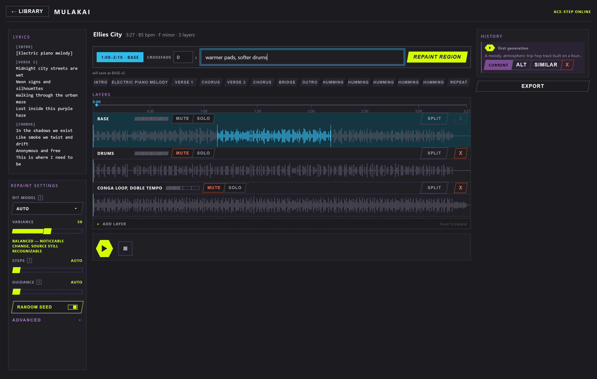

# Mulakai

A single-user, web-based **AI music editor**. Generate a song with
[ACE-Step 1.5](https://github.com/ace-step/ACE-Step), then work on it in place:
select a region on the waveform and repaint it, layer a new instrument or vocal
over it, and keep every iteration as a version you can revert to or compare.

Not a DAW and not a social music platform — one song open at a time, no
accounts, no sharing, no timeline full of clips. The whole app is built around
one loop: **generate → repaint → layer → version → export.**

<!-- TODO: add a screenshot of the Editor here — the single most useful thing
     this README could gain:   -->

## The editing model

A song is a **stack of layers**, not a multitrack arrangement:

```
Song: "Summer Nights"
│
├─ Layer: Base       [==========waveform==========]  vol/mute/solo
├─ Layer: Vocals     [        ==region==          ]  vol/mute/solo  [Repaint] [Versions ▾]
├─ Layer: Bass       [   ====region====           ]  vol/mute/solo  [Repaint] [Versions ▾]
└─ + Add Layer
```

- **Base layer** — the original generation, or an imported track.
- **Repaint** — select a time region, describe what should change there, and the
  model regenerates just that region. The result becomes a new *version* of that
  layer; the previous one stays in the layer's history.
- **Add layer** — describe an instrument or vocal part (optionally with lyrics)
  and the model generates audio conditioned on the current mix. The new layer is
  independently mixable, repaintable and versioned.
- **Versions** — every repaint or layer-add records the prompt, parameters, seed
  and region it came from, so any version can be reverted to, deleted, or
  regenerated as an alternate. History is per layer, so reverting a vocal
  repaint leaves the bass untouched.
- **Playback and export** — all audible layer versions are summed live in a Web
  Audio graph; export drops each layer as a stem, or renders a one-shot
  remaster of the whole mix.

This maps onto ACE-Step 1.5's existing task types — `text2music`, `repaint`,
`lego`, `cover`, `complete`, `extract` — one per action. No new model behaviour
is needed; the project is the editor and the orchestration around that API.

## What's in it

**Library** — a flat, searchable list of songs with folders, favourites pinned
to the top, a per-song detail rail (metadata, lyrics, cover art, output tags),
and a trash that sweeps itself after 7 days.

**Create** — three tabs, one per generation shape:

| Tab | ACE-Step task | Does |
|---|---|---|
| PROMPT | `text2music` | Generate from a caption + lyrics, with a TAKES slider for batch variants |
| AUDIO | `cover` | Regenerate an uploaded or existing track, structure preserved |
| ARRANGE | `complete` | Build a full arrangement around one bare track (e.g. a cappella vocals) |

Plus voice conditioning from a local voice library, reference audio, drafts that
survive a reload, and an ANALYZE AUDIO pass that fills caption/lyrics/BPM/key
from a source file.

**Editor** — the layer stack: a lane per layer with its own volume/mute/solo,
waveform region selection with drag-to-move/resize edges, a scrub timeline,
repaint, add-layer, per-layer version history, stem splitting (ACE-Step
`extract` or Demucs), stem export and remaster.

**Settings** — default models (DiT + LM), LoRA/LoKr adapter loading, playback
and export defaults (format, sample rate, bit depth, bitrate, steps), the voice
library, output file tagging (artist/encoder/ID3 version), library maintenance
(storage stats, restore from trash, empty trash), and the lyric-tag vocabulary
probe.

## Requirements

- **Node.js 20.19+** — client and server (Vite 8's floor).
- **ffmpeg on `PATH`** (or `FFMPEG_PATH`) — every produced audio file is
  transcoded through it. The server logs a loud warning at boot if it's missing.
- **ACE-Step 1.5**, running as a separate process with its native FastAPI server
  (not the Gradio API). This is the generation backend and is required for
  everything except browsing an existing library.
- **Python 3 + Demucs** — optional, only for the alternative stem-split backend.

Two endpoints Mulakai calls, `/v1/analyze_audio` and `/lyric_timestamp`, come
from a local fork branch of ACE-Step 1.5. If your build doesn't expose them, the
features that use them (ANALYZE AUDIO, lyric-timestamp alignment) will error;
the rest of the app is unaffected.

## Running it

Start ACE-Step first — it must be reachable at `ACESTEP_API_URL`
(default `http://127.0.0.1:8001`):

```bash
uv run acestep-api --port 8001
```

There is no root `package.json`; the client and server install and run
separately.

```bash
cd client && npm install && npm run dev     # Vite, http://localhost:5173
cd server && npm install && npm run dev     # Express, http://localhost:3001
```

On Windows, `install.bat` installs both and `start-all.bat` launches ACE-Step,
the server, the optional Demucs service and the client in one go (set
`ACESTEP_PATH` to point at your ACE-Step checkout).

Stem splitting via Demucs is optional — see
[`demucs-server/README.md`](demucs-server/README.md).

### Configuration

Server environment variables, all optional:

| Variable | Default | Meaning |
|---|---|---|
| `PORT` | `3001` | Server port |
| `HOST` | `127.0.0.1` | Bind address. The API has **no auth** — exposing it hands the library and the GPU to the whole LAN |
| `ACESTEP_API_URL` | `http://127.0.0.1:8001` | ACE-Step's native FastAPI server |
| `ACESTEP_API_KEY` | — | Sent if ACE-Step requires one |
| `ACESTEP_TIMEOUT_MS` | `60000` | Per-request ceiling on ACE-Step calls (downloads get 5×) |
| `DEMUCS_API_URL` | — | Empty disables the Demucs split backend |
| `DATA_DIR` | `server/data` | SQLite DB + generated audio |
| `POLL_INTERVAL_MS` | `2000` | Job polling interval |
| `FFMPEG_PATH` | `ffmpeg` | ffmpeg binary |

## Stack

| Part | Built with |
|---|---|
| Client | React · TypeScript · Vite · Zustand · Framer Motion · Web Audio |
| Server | Express · TypeScript · SQLite (better-sqlite3) |
| Generation | ACE-Step 1.5 (external process, native FastAPI API) |
| Stem splitting | ACE-Step `extract`, or a Demucs microservice (FastAPI, optional) |
| Tests | Vitest on both sides · oxlint |

Desktop-only SPA. Four top-level views — **Library**, **Create**, **Editor**,
**Settings** — plus FORGE, an experimental training screen that is a stub behind
a Settings toggle.

## Repository layout

```
Mulakai/
├── client/            React + TS + Vite
│   └── src/           flat: components, Zustand stores, api/, mix/ (Web Audio)
├── server/            Express + SQLite
│   ├── routes/        songs · folders · layers · versions · generate · split ·
│   │                  import · remaster · voices · adapters · lyricTags
│   ├── services/      job orchestration per task type, ACE-Step client,
│   │                  transcode, file tagging, trash sweep
│   └── db/            schema + migrations
├── demucs-server/     FastAPI stem-split microservice (optional, Python)
└── docs/              design system, UX notes, audit, ACE-Step API notes
```

**Data model** — `Song` → `Layer` → `Version`:

- **Song** — title, generation metadata, folder, favourite, `trashedAt` (drives
  the 7-day trash sweep). No users, profiles or playlists.
- **Layer** — belongs to a song; ordered, typed, with a region and
  volume/mute/solo.
- **Version** — belongs to a layer: the audio file plus the full generation
  parameters that produced it, so every version is reproducible. One version is
  active per layer.

## Design

The interface has its own design system, specified in
[`docs/design/DESIGN.md`](docs/design/DESIGN.md) and treated as the source of
truth for UI work.

Carbon `#1C1D21` canvas, zero border radius, parallelograms for choices,
hexagons for transport, 1px hairlines, bold uppercase structural type. Colour
carries exactly one job per hue: acid `#D4FF00` commits an action, sky `#30BCED`
marks selection and scope, lilac `#7B4B94` marks versions, history and AI, rust
`#CC3F0C` marks errors and trash.

The interaction rhythm follows from that — **target** (select a region) then
**commit** (generate or repaint), with every generative or destructive action
stating its consequence inline before it fires.

## Development

```bash
npm test        # Vitest — run in client/ or server/
npm run build   # tsc + vite build (client/)
npm run lint    # oxlint (client/)
```

Development is AI-assisted throughout, and the workflow is written down rather
than improvised: [`AGENTS.md`](AGENTS.md) holds the rules of the road
(scope discipline, a 200-LOC hard cap per module, one problem per PR, tests
required), [`CLAUDE.md`](CLAUDE.md) the agent instructions loaded into every
session, and [`PLAN.md`](PLAN.md) is a dated spec log — every non-trivial
feature gets its decisions, file-level plan and open questions written down
before the code exists.

Work goes through pull requests against `main`.

## Status

Working prototype under active development, built for a single local user on
one machine. Known gaps are tracked in [`docs/AUDIT.md`](docs/AUDIT.md) —
including that the Playwright end-to-end suite required by `AGENTS.md` is not
set up yet.

The server has **no authentication** and is bound to localhost for that reason.
Don't expose it.

## Licence

[MIT](LICENSE).

Mulakai reaches ACE-Step 1.5 and Demucs over HTTP as separate processes, so
neither is redistributed here and their own licences apply to them. One
dependency, `node-taglib-sharp` (audio file tagging), is LGPL-2.1-or-later and
is pulled unmodified from npm rather than vendored.
